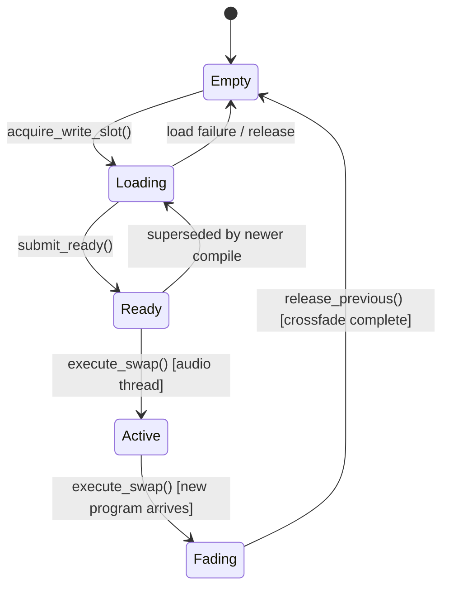

# Cedar VM Architecture

Cedar is a register-based bytecode VM for real-time audio synthesis, designed for live-coding with glitch-free hot-swapping. It processes 128-sample blocks at 48kHz through a flat instruction stream that reads and writes to a pool of 256 SIMD-aligned buffers. All memory is pre-allocated — zero heap allocations occur during audio processing.

## Table of Contents

1. [Architecture Overview](#architecture-overview)
2. [Bytecode Format](#bytecode-format)
3. [VM Execution](#vm-execution)
4. [Hot-Swap Mechanism](#hot-swap-mechanism)
5. [State Pool](#state-pool)
6. [Audio Arena](#audio-arena)
7. [External Parameters](#external-parameters)
8. [Opcode Categories](#opcode-categories)
9. [Polyphony](#polyphony)
10. [Constants and Limits](#constants-and-limits)
11. [Key Source Files](#key-source-files)

## Architecture Overview

```mermaid
graph TD
    subgraph "Compiler Thread"
        SRC[Akkado Source] --> COMPILER[Compiler Pipeline]
        COMPILER --> BYTECODE[Bytecode — Instruction array]
    end

    subgraph "Audio Thread"
        SWAP[SwapController — Triple Buffer] --> DISPATCH[VM Dispatch Loop]
        DISPATCH --> OUTPUT[Output L/R]
        DISPATCH <--> BUFFERS[BufferPool — 256 registers]
        DISPATCH <--> STATES[StatePool — Persistent DSP state]
        DISPATCH <--> ARENA[AudioArena — 32MB bump allocator]
        DISPATCH <--> SAMPLES[SampleBank]
        DISPATCH <--> ENV[EnvMap — External params]
    end

    subgraph "Crossfade"
        XFADE[CrossfadeState] --> |mix old + new| OUTPUT
    end

    BYTECODE --> |load_program| SWAP
    HOST[Host Thread] --> |set_param| ENV

    style SRC fill:#2d333b,stroke:#444
    style OUTPUT fill:#2d333b,stroke:#444
    style HOST fill:#2d333b,stroke:#444
```



The compiler thread produces bytecode and submits it to the triple-buffer swap controller via `load_program()` (lock-free, never blocks). The audio thread picks up the new program at the next block boundary. During crossfade, both old and new programs execute simultaneously and their outputs are mixed with equal-power gains over 2–5 blocks (~5–13ms).

## Bytecode Format

### Instruction Layout (20 bytes / 160 bits)

```
Byte:  0       1       2-3          4-5     6-7     8-9    10-11   12-13   14-15   16-19
     +-------+-------+------------+-------+-------+-------+-------+-------+-------+-----------+
     |opcode | rate  | out_buffer |  in0  |  in1  |  in2  |  in3  |  in4  | flags | state_id  |
     | (u8)  | (u8)  |   (u16)    | (u16) | (u16) | (u16) | (u16) | (u16) | (u16) |   (u32)   |
     +-------+-------+------------+-------+-------+-------+-------+-------+-------+-----------+
```

| Field | Size | Description |
|---|---|---|
| `opcode` | 8 bits | Operation to perform (see [Opcode Categories](#opcode-categories)) |
| `rate` | 8 bits | `0` = audio-rate (per-sample), `1` = control-rate (per-block), or packed enum parameters (LFO shape, clock mode, array length) |
| `out_buffer` | 16 bits | Destination buffer index (0–254). Buffer 255 is reserved as `BUFFER_ZERO` (always 0.0) |
| `inputs[0–4]` | 5 × 16 bits | Input buffer indices. `0xFFFF` = unused |
| `flags` | 16 bits | Per-instruction attribute bits. Currently defined: `STEREO_INPUT` (bit 0) |
| `state_id` | 32 bits | FNV-1a hash for persistent DSP state lookup. `0` = stateless |

Design notes:
- Fixed 20-byte width for cache-friendly sequential access (`alignas(4)`, `static_assert(sizeof == 20)`)
- The `flags` field occupies what used to be implicit padding before the 4-byte-aligned `state_id`, so struct size is unchanged
- 32-bit `state_id` avoids birthday-paradox collisions at 512 states (16-bit would collide at ~256)
- Convenience constructors: `make_nullary` through `make_quinary` for 0–5 input arities

#### `STEREO_INPUT` flag

When `flags & InstructionFlag::STEREO_INPUT` is set, the VM runs the opcode *twice* per invocation — once for the left channel, once for the right — with independent per-channel DSP state. This is how Akkado's auto-lift (prd-stereo-support §6) turns any mono opcode into a stereo variant at zero opcode-table cost:

- **Left pass:** reads `inputs[i]`, writes `out_buffer`, uses `state_id`.
- **Right pass:** reads `inputs[0] + 1` (the adjacent right buffer), writes `out_buffer + 1`, uses `state_id XOR STEREO_STATE_XOR_R` (a golden-ratio constant) so L and R have independent filter memory, delay lines, oscillator phase, etc.
- **Scalar/control inputs** (`inputs[1..4]`) are shared — both channels see the same cutoff frequency, resonance, etc. Per-channel control requires explicit stereo construction.

Stateless opcodes (distortion, fold, saturate) simply ignore the XOR'd `state_id` and produce correct audio without any special handling. See `cedar/src/vm/vm.cpp` (`VM::execute`) for the dispatch wrapper.

### Rate Field Overloading

The `rate` field serves double duty:

| Usage | Encoding | Examples |
|---|---|---|
| Processing rate | `0` = audio, `1` = control | Most opcodes |
| Packed enum | Low 4 bits / high 4 bits / full byte | LFO shape (0–6), CLOCK mode (0=beat, 1=bar, 2=cycle) |
| Array metadata | Full byte = element count or length | ARRAY_PACK count, ARRAY_UNPACK index |
| FFT size | `log2(fft_size)` | FFT_PROBE (8=256, 11=2048) |
| Poly body length | Instruction count of body | POLY_BEGIN |

## VM Execution

### Block Processing

Each call to `process_block(float* out_left, float* out_right)` processes one 128-sample block:

1. Clear output buffers
2. `handle_swap()` — check for pending program swap at block boundary
3. Fetch current program slot (early exit if none loaded)
4. `update_timing()` — derive `beat_phase` and `bar_phase` from `global_sample_counter`
5. If crossfading: `perform_crossfade()` (execute both programs, mix outputs)
   Else: `execute_program()` (normal execution)
6. Advance counters: `global_sample_counter += BLOCK_SIZE`, `block_counter++`

### Dispatch

Instructions execute sequentially via a switch statement with compiler-generated jump table. Hot opcodes (ADD, SUB, MUL, OSC_SIN, OUTPUT, LFO) are annotated with `[[likely]]` for branch prediction. Each opcode dispatches to an inline function:

```cpp
void op_filter_svf_lp(const ExecutionContext& ctx, const Instruction& inst);
```

The instruction pointer advances linearly except when `POLY_BEGIN` is encountered, which triggers a nested voice iteration loop (see [Polyphony](#polyphony)).

### ExecutionContext

All runtime state needed by opcodes is carried in a single struct:

| Field | Type | Description |
|---|---|---|
| `buffers` | `BufferPool*` | 256 audio "registers" (128 floats each, 32-byte aligned) |
| `states` | `StatePool*` | Persistent DSP state (oscillator phases, filter memory, delay lines) |
| `arena` | `AudioArena*` | Bump allocator for large buffers (delays, reverbs) |
| `env_map` | `EnvMap*` | External parameter bindings |
| `output_left/right` | `float*` | Stereo output buffers provided by audio callback |
| `sample_rate` | `float` | Current sample rate (default 48kHz) |
| `inv_sample_rate` | `float` | Cached `1/sample_rate` |
| `bpm` | `float` | Current tempo (default 120) |
| `global_sample_counter` | `uint64_t` | Total samples since start |
| `block_counter` | `uint64_t` | Total blocks since start |
| `beat_phase` | `float` | 0–1 phase within current beat |
| `bar_phase` | `float` | 0–1 phase within current bar (4 beats) |

Timing is derived once per block from `global_sample_counter`.

## Hot-Swap Mechanism

Cedar uses a triple-buffer design for glitch-free live code updates. See [cedar-vm-hot-swap-implementation.md](cedar-vm-hot-swap-implementation.md) for the full implementation spec.

### Triple-Buffer Swap Controller

`SwapController` holds 3 `ProgramSlot` objects (cache-line aligned). At any time, one slot is Active (being executed), one may be Fading (crossfading out), and the rest are Empty, Loading, or Ready.

**Compiler thread** (non-realtime):
1. `acquire_write_slot()` — claim an Empty slot via CAS; if none available, supersede a Ready slot
2. Write bytecode and metadata into the slot
3. `submit_ready()` — mark slot as Ready, set `swap_pending_` atomic flag

**Audio thread** (realtime, at block boundaries):
1. `handle_swap()` checks `swap_pending_`
2. `execute_swap()` — Active → Fading, Ready → Active
3. Rebind state IDs (mark new program's states as touched for GC)
4. Start crossfade if replacing an existing program

### Program Slot Lifecycle



Each slot also carries a `ProgramSignature` (FNV-1a hash of all state IDs, instruction count, unique state count) for structural change detection.

### Crossfade

When a swap occurs, both old and new programs execute into separate stereo buffer pairs, then outputs are mixed:

| Phase | Description |
|---|---|
| Idle | No crossfade active |
| Pending | Swap queued, will start next block |
| Active | Both programs executing, outputs mixed each block |
| Completing | Final block done, triggers GC sweep |

**Equal-power mixing** maintains perceived loudness during the transition:

```
old_gain = cos(position * PI/2)    // 1.0 → 0.0
new_gain = sin(position * PI/2)    // 0.0 → 1.0
out[i] = old[i] * old_gain + new[i] * new_gain
```

Duration is configurable: 2–5 blocks (default 3 = ~8ms at 48kHz).

### Thread Safety

- All slot state transitions use `compare_exchange_strong` with acquire-release ordering
- `swap_pending_` atomic flag prevents redundant scans
- Latest version wins: a Ready slot can be superseded if the compiler produces a newer version before the audio thread swaps
- No mutexes in the audio path

## State Pool

### Design

Open-addressing hash table with linear probing, fixed at `MAX_STATES = 512` slots. Each entry holds `{key: u32, state: DSPState, occupied: bool}`.

`DSPState` is a `std::variant` over ~30 state types: oscillators (OscState, MinBLEPOscState, OscState4x), filters (SVFState, MoogState, DiodeState, FormantState, SallenkeyState), delays (DelayState, PingPongDelayState), reverbs (FreeverbState, DattorroState, FDNState), envelopes (EnvState), modulation effects (ChorusState, FlangerState, PhaserState, CombFilterState), dynamics (CompressorState, LimiterState, GateState), distortion (BitcrushState, SmoothSatState, FoldADAAState, TubeState, TapeState, XfmrState, ExciterState), samplers (SamplerState, SoundFontVoiceState), sequencing (LFOState, TriggerState, EuclidState, TimelineState, TransportState, SequenceState), polyphony (PolyAllocState), visualization (ProbeState, FFTProbeState), and ExtendedParams<N>.

### State Lookup

```cpp
auto& state = ctx.states->get_or_create<SVFState>(inst.state_id);
```

1. Apply XOR isolation: `effective_id = state_id ^ state_id_xor_` (for polyphony)
2. Hash lookup with linear probing
3. If slot empty: default-construct the state type
4. If slot occupied but wrong type: replace with correct type
5. Mark slot as `touched` (for GC)

### Garbage Collection Cycle

State GC runs around hot-swaps to clean up orphaned states without audio artifacts:

1. **`begin_frame()`** — clear all `touched_` flags at block start
2. **Program execution** — each `get_or_create()` sets `touched_[idx] = true`
3. **Crossfade completes → `gc_sweep()`**:
   - Untouched states move to the **fading pool** with `fade_gain = 1.0`
   - Active slot cleared immediately
4. **Every block: `advance_fading()`** — decrement `fade_gain` by `1.0 / fade_blocks`
5. **Every block: `gc_fading()`** — remove entries where `blocks_remaining == 0`

This ensures states no longer referenced by any program fade out silently rather than popping.

## Audio Arena

32MB bump allocator (`AudioArena`) for large DSP buffers that don't fit in the fixed-size state variant.

| Property | Value |
|---|---|
| Default size | 32 MB |
| Alignment | 32 bytes (AVX-compatible) |
| Allocation | Bump pointer, zero-initialized |
| Deallocation | None individual — only `reset()` invalidates all pointers |
| Users | DelayState, FreeverbState, DattorroState, FDNState, PingPongDelayState, PolyAllocState, FFTProbeState, SoundFontVoiceState |

States call `arena.allocate(num_floats)` once during first access. The returned `float*` persists for the state's lifetime. Arena reset only occurs on full `StatePool::reset()`.

## External Parameters

`EnvMap` provides lock-free parameter binding between host and audio threads.

**Architecture**: open-addressing hash table (512 slots) with atomic `target` values and per-sample interpolation.

| Thread | Operation |
|---|---|
| Host | `set_param(name, value, slew_ms)` — hashes name via FNV-1a, stores `target` atomically |
| Audio | `update_interpolation_block()` — per-sample: `current += (target - current) * slew_coeff` |

The `ENV_GET` opcode reads the interpolated `current` value by matching `inst.state_id` to the parameter's name hash. This enables smooth, click-free parameter updates from DAW knobs, OSC, MIDI, or the web UI.

## Opcode Categories

Opcodes are organized in ranges of 10, with gaps for future expansion. ~120 active opcodes across 21 categories:

| Category | Range | Count | Description |
|---|---|---|---|
| Stack/Constants | 0–9 | 3 | NOP, fill buffer with constant, buffer copy |
| Arithmetic | 10–19 | 6 | Per-sample add, sub, mul, div, pow, negate |
| Oscillators | 20–29 | 10 | Band-limited waveforms: sin, tri, saw, sqr, phasor, MinBLEP, PWM variants (PolyBLEP anti-aliasing) |
| Filters | 30–39 | 7 | SVF (LP/HP/BP), Moog 4-pole ladder, diode ladder (TB-303), formant (vowel morph), Sallen-Key (MS-20) |
| Math | 40–49 | 10 | abs, sqrt, log, exp, min, max, clamp, wrap, floor, ceil |
| Utility | 50–59 | 7 | Stereo output, white noise, MIDI-to-freq, DC offset, slew limiter, sample-and-hold, env_get |
| Envelopes | 60–62 | 3 | ADSR, AR, envelope follower |
| Samplers | 63–65 | 3 | One-shot playback, looped playback, SoundFont voice |
| Delays/Reverbs | 70–75 | 6 | Delay line, Freeverb (Schroeder-Moorer), Dattorro plate, FDN, coordinated tap/write pair |
| Modulation | 80–83 | 4 | Chorus (3-voice), flanger, phaser (12-stage allpass), comb filter |
| Distortion | 84–89, 96–98 | 9 | tanh, soft clip, bitcrush, wavefold (ADAA), tube, smooth (ADAA), tape, transformer, exciter |
| Sequencing | 90–95 | 5 | Beat/bar clock, beat-synced LFO, euclidean rhythm, trigger, timeline automation |
| Dynamics | 100–102 | 3 | Feedforward compressor, brick-wall limiter, noise gate with hysteresis |
| Oversampled Osc | 110–119 | 6 | 4× oversampled sin, saw, sqr, tri, PWM variants — for alias-free FM synthesis |
| Trig Math | 120–126 | 7 | sin, cos, tan, asin, acos, atan, atan2 (pure math, not oscillators) |
| Hyperbolic Math | 130–132 | 3 | sinh, cosh, tanh (pure math) |
| Logic | 140–149 | 10 | Ternary select, comparisons (>, <, >=, <=, ==, !=), and, or, not |
| Polyphony | 150–151 | 2 | POLY_BEGIN/POLY_END block markers |
| Pattern Queries | 152–156 | 5 | Sequence query, step, type ID, gate, trigger-driven transport |
| Arrays | 160–169 | 10 | pack, index, unpack, len, slice, concat, push, sum, reverse, fill (max 128 elements) |
| Stereo | 170–174 | 5 | Constant-power pan, stereo width, mid/side encode/decode, ping-pong delay |
| Debug | 180–182 | 3 | Signal probe (ring buffer), FFT probe (spectrum), IFFT (reserved) |

### Stateful vs Stateless

- **Stateless** opcodes (arithmetic, math, logic, arrays) have `state_id = 0` and process each block independently
- **Stateful** opcodes (oscillators, filters, delays, envelopes, sequencers) use `state_id` to look up persistent state in the StatePool. State persists across blocks and across hot-swaps (matched by semantic ID)

## Polyphony

`POLY_BEGIN` and `POLY_END` bracket a body of instructions that execute once per active voice (up to 32).

### Voice Allocation

`PolyAllocState` (arena-allocated) manages voice assignment:
- Reads note events from a linked `SequenceState` with sample-accurate timing (double-precision beat math)
- Supports poly, mono, and legato allocation modes
- Voice stealing by age when all slots are occupied

### Per-Voice Execution

For each active voice, the VM:
1. Fills parameter buffers (`freq`, `gate`, `vel`, `trig`) from the voice's current event
2. Sets XOR isolation: `state_id_xor = voice_idx * 0x9E3779B9 + 1` (golden-ratio Fibonacci hashing)
3. Executes the body instructions — each `get_or_create()` call sees a unique effective state ID
4. Reads the voice output buffer, applies gating, accumulates into the mix buffer
5. Resets XOR isolation

This ensures every voice has independent oscillator phases, filter memory, envelope stages, etc., without needing separate instruction streams.

## Constants and Limits

| Constant | Value | Notes |
|---|---|---|
| `BLOCK_SIZE` | 128 samples | 2.67ms at 48kHz |
| `DEFAULT_SAMPLE_RATE` | 48,000 Hz | Configurable via `set_sample_rate()` |
| `DEFAULT_BPM` | 120 | Configurable via `set_bpm()` |
| `MAX_BUFFERS` | 256 | Buffer 255 = `BUFFER_ZERO` (always 0.0) |
| `MAX_STATES` | 512 | Open-addressing hash table capacity |
| `MAX_PROGRAM_SIZE` | 4,096 instructions | 80 KB at 20 bytes/instruction |
| `MAX_VARS` | 4,096 | Variable slots |
| `MAX_ENV_PARAMS` | 256 | External parameter slots |
| `BUFFER_UNUSED` | `0xFFFF` | Sentinel for unused input slots |
| AudioArena default | 32 MB | 32-byte aligned bump allocator |
| EnvMap hash table | 512 slots | Open-addressing, linear probing |
| Crossfade duration | 2–5 blocks | Default 3 (~8ms) |
| Max poly voices | 32 | Per `POLY_BEGIN` block |
| Instruction size | 20 bytes | Fixed-width, `alignas(4)` |
| Swap slots | 3 | Triple-buffer (Active / Fading / Ready) |

## Key Source Files

| File | Purpose |
|---|---|
| `cedar/include/cedar/dsp/constants.hpp` | Block size, sample rate, buffer limits, sentinel values |
| `cedar/include/cedar/vm/instruction.hpp` | `Opcode` enum (all opcodes), `Instruction` struct (20-byte layout) |
| `cedar/include/cedar/vm/vm.hpp` | VM class: `load_program`, `process_block`, `seek`, parameter API |
| `cedar/src/vm/vm.cpp` | Execution loop, dispatch switch, crossfade mixing, polyphony |
| `cedar/include/cedar/vm/swap_controller.hpp` | Triple-buffer lock-free program swap with CAS transitions |
| `cedar/include/cedar/vm/program_slot.hpp` | `ProgramSlot` with signature computation and state tracking |
| `cedar/include/cedar/vm/crossfade_state.hpp` | Crossfade phase machine and equal-power mixing |
| `cedar/include/cedar/vm/state_pool.hpp` | Typed DSP state, open-addressing hash table, GC, fading pool |
| `cedar/include/cedar/vm/buffer_pool.hpp` | 256 SIMD-aligned audio buffers (131 KB total) |
| `cedar/include/cedar/vm/audio_arena.hpp` | 32 MB bump allocator for delay/reverb buffers |
| `cedar/include/cedar/vm/env_map.hpp` | Lock-free external parameter binding with interpolation |
| `cedar/include/cedar/vm/context.hpp` | `ExecutionContext` with timing, pools, and output pointers |
| `cedar/include/cedar/opcodes/dsp_state.hpp` | All DSP state type definitions (`DSPState` variant) |
| `cedar/include/cedar/opcodes/*.hpp` | Opcode implementations by category |
